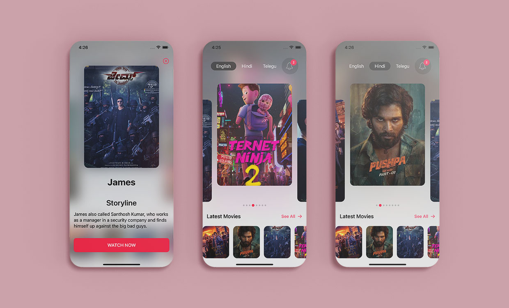

# Movie Streaming App UI

Animated Movie Streaming App UI using SwiftUi 3.0 🤓

[](https://opensource.org/licenses/Apache-2.0)
[](https://github.com/shameemreza/moviestreamingui/blob/main/LICENSE)


## Video Preview

[](https://youtu.be/YpqZo92yCcg "Movie Streaming App UI")


## Screenshots




## Features

* Smooth Hero Animation
* SwiftUI Animated Carousel Slider
* SwiftUI 3D Card Animation
* SwiftUI Snap Carousel
* SwiftUI Delay Animations
* SwiftUI Matched Geometry Effect
* SwiftUI 3D Animations
* SwiftUI Overlay
* SwiftUI Complex UI
* SwiftUI for iOS 15


Thanks for the Animation: [Balaji Venkatesh](https://kavsoft.dev)

Dribble Shot 👉 [Click Here](https://dribbble.com/shots/17879744-Movie-Streaming-App-UI)

## License

```
Copyright 2022 Shameem Reza

Licensed under the Apache License, Version 2.0 (the "License");
you may not use this file except in compliance with the License.
You may obtain a copy of the License at

   http://www.apache.org/licenses/LICENSE-2.0

Unless required by applicable law or agreed to in writing, software
distributed under the License is distributed on an "AS IS" BASIS,
WITHOUT WARRANTIES OR CONDITIONS OF ANY KIND, either express or implied.
See the License for the specific language governing permissions and
limitations under the License.
```

